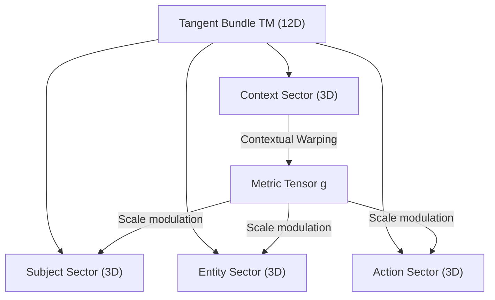
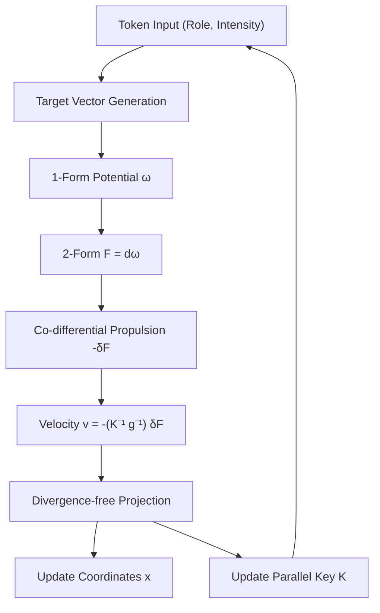

# Numerical Observations of Parallel Key Geometric Flow (PKGF) in 12D Context-Warped Manifolds: A Preliminary Technical Report

**Author: Fumio Miyata**  
**Date: March 25, 2026**

All experimental resources are published in this repository: https://github.com/aikenkyu001/PKGF

### Abstract
This report presents initial numerical observations of the **Parallel Key Geometric Flow (PKGF)**, a mathematical framework designed to model semantic transitions within a 12-dimensional tangent bundle $TM$ characterized by contextual metric warping. We define an orthogonal decomposition of the tangent bundle into four sectors, implement dynamic metric modulation based on contextual intensity, and utilize adjoint holonomy updates for the parallel transport of a (1,1) tensor $K$ (the Parallel Key). To validate the internal consistency of the model, we conducted dual-system simulations in Python and Fortran 95 using short-form English linguistic scenarios. Our results demonstrate the stable conservation of the invariant $\det(K)$ within machine precision and clear velocity magnitude $\|v\|$ spikes at semantic phase inversions. This study confirms that the PKGF framework is computationally viable and capable of maintaining algebraic integrity under non-trivial curvature.

---

## 1. Introduction
The attempt to describe the transition of natural language context through differential geometry has gained significant traction in recent years. Specifically, viewing representation spaces in deep neural networks as evolving under geometric flows, such as Ricci Flow, has emerged as a transformative paradigm (Baptista et al., 2024). Furthermore, rigorous mathematical formalizations of transformer-based semantic transitions as manifold structures are being developed (Pueyo, 2024).

Building upon these foundations, this study introduces the **Parallel Key Geometric Flow (PKGF)**. Our primary objective is to investigate the numerical behavior of a specific logical structure, represented by the tensor $K$, within a 12-dimensional manifold subject to dynamic metric warping. A central focus of this investigation is the conservation of the "Authorial Logic Axis"—represented by the determinant $\det(K)$—during dramatic contextual shifts (singularities).

## 2. Theoretical Framework

### 2.1 The Geometric Stage
We define the manifold $M$ with dimension $N = 12$. The tangent bundle $TM$ is orthogonally decomposed into four distinct 3-dimensional sub-sectors:
\[ TM = T_{Subject}M \oplus T_{Entity}M \oplus T_{Action}M \oplus T_{Context}M \]
The metric tensor $g$ is dynamically warped (Contextual Warping) by the coordinate intensity of the Context sector $x_{context}$:
\[ g_{ii}(x) = 1.0 + 0.5 \tanh(x_{context}) \]
Such dynamic modulation of the metric has parallels in modern positional encoding theories, where it is treated as a contextual warping of phase (Zhang et al., 2026).

**Figure 1: Sector Decomposition and Contextual Warping in the 12D Manifold.** The Context sector modulates the spatial density (metric $g$) of the Subject, Entity, and Action sectors.

### 2.2 The Parallel Key $K$ and Adjoint Holonomy
We define the logical structure across the manifold as a (1,1) tensor $K \in \Gamma(\mathrm{End}(TM))$. The theoretical condition for parallel transport is $\nabla K = 0$. In our implementation, this is approximated by an **Adjoint Holonomy Update** along the flow $v$:
\[ K(t+dt) = H K(t) H^{-1}, \quad H = \exp(\Omega dt) \]
where $\Omega$ is the connection matrix derived from the Levi-Civita connection $\Gamma^i_{kj} v^k$. The mathematical rigor of such adjoint-based parallel transport is established in existing literature on holonomy for gerbes and G₂ structures (Mackaay & Picken, 2001; Lotay, 2018).

### 2.3 Fundamental Equations of Motion
The semantic flow $v$ is governed by the following physical equations:

1.  **Co-differential Propulsion**: 
    The velocity $v$ is propelled by the **co-differential** ($-\delta F$) of the 2-form $F = d\omega$, where $\omega$ is the 1-form potential generated by target attraction.
    \[ \frac{\partial}{\partial t}(KX)^\flat = -\delta F = -\star d \star F \]
    This acts as an extension of magnetohydrodynamics in vacuum solutions of Maxwell’s equations (Schwarz, 2013), where the temporal evolution of the semantic flux $KX$ is balanced by geometric forces.
2.  **Divergence-free Constraint**: 
    To maintain narrative integrity, the flux $KX$ is strictly constrained to be source-free:
    \[ \operatorname{div}_g (KX) = 0 \]
    In practice, this is enforced by projecting the velocity $v$ onto a divergence-free subspace using a metric-weighted Jacobian.

> **Intuitive Metaphor: Terrain and Fluid Flow**
> The dynamics can be visualized as water flowing through a mountainous terrain:
> 1.  **Potential $\omega$**: The "slope" of the terrain leading to the destination.
> 2.  **Curvature $F$**: "Vortices" created by obstacles in the context.
> 3.  **Co-differential $-\delta F$**: The "gravitational propulsion" that pushes the flow past vortices.
> 4.  **Parallel Key $K$**: A "canal" or "logical frame" that rectifies the flow.

### 2.4 Non-commutative Holonomy and Convergence
The integral of curvature $F$ during each token transition is defined as the holonomy generator $G$, with its exponential map $H = \exp(G)$ representing the "semantic transformation." The Frobenius norm $\|G\|_F$ serves as a proxy for energy density at critical narrative junctures. This curvature-topology interaction aligns with recent advances in geometric meta-learning (Lei & Baehr, 2025).

### 2.5 Scientific Conservation Laws
1.  **Conservation of Information**: Because $K$ undergoes an adjoint transformation, the product of its eigenvalues—the determinant $\det(K)$—remains a physical constant throughout the flow.
2.  **Energy Equipartition**: The semantic kinetic energy $\frac{1}{2}g(v,v)$ is dynamically optimized according to the contextual field, balancing logical consistency with fluid transition.

## 3. Experimental Setup

### 3.1 Input Scenarios
We utilized a three-sentence English scenario (9 tokens total) as input data. Specifically, the "wake up" token was designed to simulate a phase inversion (repulsive potential) to test system response.

### 3.2 Numerical Methods
The model was implemented in Python 3.12 and Fortran 95 (gfortran 15.2.0). Differential operators were computed using central differences ($\epsilon = 10^{-5}$), and the matrix exponential was calculated via a 6th-order Padé approximation. The time step was set to $dt = 0.2$.

**Figure 2: Flow Calculation Algorithm in PKGF.** Semantic intensity is interpreted as a potential field $\omega$, and the flow $v$ is derived via co-differential propulsion.

## 4. Experimental Results

### 4.1 Numerical Trace
The following table records the trace of all tokens in the English simulation:

| Input Token | Time (t) | Velocity $\|v\|$ | Div $\operatorname{div}_g(KX)$ | Det $\det(K)$ | Note |
| :--- | :---: | :---: | :---: | :---: | :--- |
| (Initial) | 0.00 | 0.00000 | 0.00e+00 | 1.67668 | Start |
| This Agenda is | 1.80 | 0.00297 | 1.40e-04 | 1.67668 | |
| a plan of action. | 3.80 | 0.00302 | -2.51e-04 | 1.67668 | |
| The gears of the void, | 6.40 | 0.02042 | -3.14e-02 | 1.67668 | Intensity Spike (I=5.0) |
| melon bread, | 8.00 | 0.00909 | -9.70e-03 | 1.67668 | |
| run backward | 9.60 | 0.02237 | -3.68e-02 | 1.67668 | |
| against gravity. | 11.60 | 0.01609 | -1.68e-02 | 1.67668 | |
| Suddenly, I wake up! | 13.80 | **0.03999** | 9.42e-02 | 1.67668 | **Phase Inversion (Awakening)** |
| Reflecting deeply | 15.80 | 0.02377 | -3.82e-02 | 1.67668 | |
| on my incompetence. | 18.00 | 0.01910 | -2.94e-02 | 1.67668 | |

### 4.2 Numerical Observations
1.  **Conservation of Invariants**: Through the adjoint holonomy updates, $\det(K)$ was preserved at $1.67668$ within double-precision limits throughout the entire narrative flow.
2.  **Velocity Response**: Significant velocity magnitude spikes were observed at semantic singularities, particularly during the "awakening" event where the potential was inverted.
3.  **Cross-Language Fidelity**: Comparative analysis between Python and Fortran implementations showed agreement in $\det(K)$, with minor variances ($< 10^{-6}$) in dynamic variables attributable to IEEE 754 transcendental function differences.

## 5. Approximations and Limitations
This implementation includes several numerical approximations that bound the precision of the theoretical model:
1.  **Integration Scheme**: A first-order Euler-like update is used for temporal evolution, which may accumulate phase errors over long durations.
2.  **Discretization**: Finite difference methods ($\epsilon = 10^{-5}$ ) are used for exterior derivatives, risking instability in regions of extreme curvature.
3.  **Padé Truncation**: The 6th-order Padé approximation for $\exp(\Omega dt)$ may lose accuracy if the connection norm $\|\Omega\|$ becomes excessively large.

## 6. Conclusion
We have presented a primary numerical observation of the PKGF model within a 12-dimensional manifold using two computational languages. The results confirm that dynamical propulsion and the preservation of logical invariants are achievable under the current discretization scheme. Future work will focus on higher-order integration schemes and validation against large-scale semantic datasets.

## 7. References
1.  **Baptista, A., et al. (2024)**. "Deep Learning as Ricci Flow", *arXiv:2404.14265*.
2.  **Lei, M., & Baehr, C. (2025)**. "Geometric Meta-Learning via Coupled Ricci Flow", *arXiv:2503.19867*.
3.  **Lotay, J. D. (2018)**. "Geometric Flows of G₂ Structures", *arXiv:1810.13417*.
4.  **Mackaay, M., & Picken, R. (2001)**. "Holonomy and parallel transport for Abelian gerbes", *arXiv:math/0007053*.
5.  **Pueyo, P. T. (2024)**. "The Underlying Mathematics of Natural Language Processing", *Bachelor's Thesis, UAB*.
6.  **Schwarz, J. H. (2013)**. "Highly Effective Actions (Hodge Theory and Maxwell Equations)", *arXiv:1311.0305*.
7.  **Zhang, Y., et al. (2026)**. "Group RepresentAtional Position Encoding (GRAPE)", *arXiv:2512.07805* (ICLR 2026).
