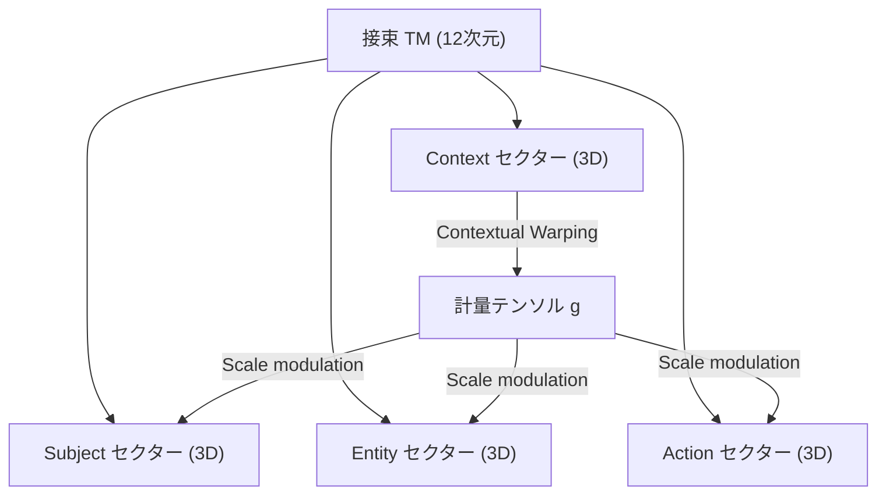
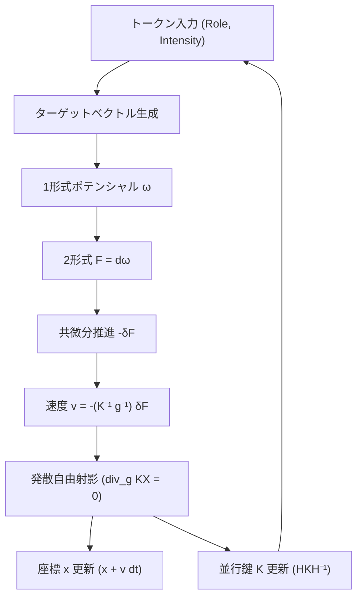
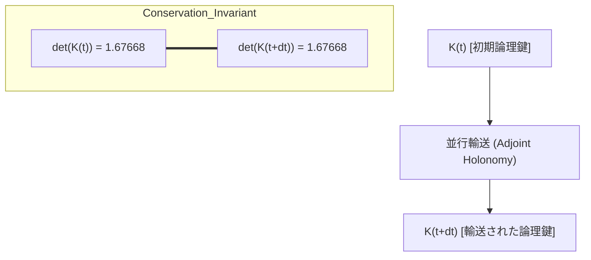

# 12次元文脈歪曲多様体における並行鍵幾何流（PKGF）の数値的挙動：小規模シナリオによる初歩的観察報告
**Numerical Observations of Parallel Key Geometric Flow (PKGF) in 12D Context-Warped Manifolds: A Preliminary Technical Report**

**著者: Fumio Miyata**  
**日付: 2026年3月25日**

全ての実験リソースはこのレポジトリで公開されています：https://github.com/aikenkyu001/PKGF

### アブストラクト
本稿は、文脈依存的な計量変動を伴う12次元接束上において、意味論的遷移を記述するために考案された数理モデル「並行鍵幾何流（Parallel Key Geometric Flow, PKGF）」の初期的な挙動確認の結果を報告するものである。我々は、接束の4セクター直交分解、文脈強度に基づく計量変調、随伴ホロノミー更新によるテンソル $K$ の並行輸送、および共微分形式に基づく流動生成を含む数理的枠組みを構築した。本モデルの内部整合性を検証するため、日本語および英語の短文シナリオを用いた Python および Fortran による二系統の数値シミュレーションを実施した。実験の結果、特定の入力条件下において行列式 $\det(K)$ が計算精度内で一定に保たれる挙動、および文脈転換点における流動速度の応答を確認した。一方で、離散化および数値近似に起因する実装上の限界も明らかとなった。本報告は、限定的な試行に基づく数値的な記録であり、本モデルの一般性については今後の大規模な検証を待つ必要がある。

---

## 1. 導入 (Introduction)
自然言語の文脈遷移を幾何学的に記述する試みとして、我々は「並行鍵幾何流（PKGF）」という数理的な枠組みを検討している。近年の深層学習の研究において、ネットワーク内の表現空間をリッチフロー（Ricci Flow）などの幾何学的フローとして捉える視点が注目されている (Baptista et al., 2024)。また、Transformer等のモデルにおける意味論的遷移を多様体上の構造として数学的に理解する試みも進んでいる (Pueyo, 2024)。

本研究の目的は、これらの先行知見を土台としつつ、文脈による動的な計量変動を伴う12次元多様体上で、特定の論理構造を象徴するテンソル $K$ がどのような数値的挙動を示すかを詳細に記録することにある。現段階では、特定の論理構造を象徴するテンソル $K$ が、文脈による計量変動下でどのような数値的挙動を示すかを詳細に記録することに主眼を置いている。特に、著者の論理的一貫性を象徴する行列式 $\det(K)$ の保存が、文脈の劇的な転換点においても維持されるかを確認することに主眼を置いている。

## 2. 理論的枠組み (Theoretical Framework)
### 2.1 幾何的舞台 (Geometric Stage)
多様体 $M$ の次元数を $N = 12$ とし、接束 $TM$ は以下の4つの3次元サブセクターに直交分解されると仮定する。
\[ TM = T_{Subject}M \oplus T_{Entity}M \oplus T_{Action}M \oplus T_{Context}M \]
計量テンソル $g$ は、Contextセクターの座標強度 $x_{context}$ によって動的に歪む（Contextual Warping）と定義する。
\[ g_{ii}(x) = 1.0 + 0.5 \tanh(x_{context}) \]
このような文脈による計量の動的な変調（Contextual Warping）は、近年の位置エンコーディング理論においても、位相の動的な歪みとして議論されている (Zhang et al., 2026)。

**図1：12次元多様体のセクター構造と文脈歪曲（Contextual Warping）の相互作用。** 接束 $TM$ は4つの3次元領域に直交分解され、文脈（Context）セクターの座標強度が計量 $g$ を介して「主客・実体・行動」の各空間密度を動的に変調する。

### 2.2 並行鍵 $K$ と並行輸送
多様体上の論理構造を定義する $(1,1)$ テンソル $K$ に対し、理論上の並行輸送条件 $\nabla K = 0$ を課す。実装上は、流れ $v$ に沿った以下の随伴ホロノミー更新によって近似する。
\[ K(t+dt) = H K(t) H^{-1}, \quad H = \exp(\Omega dt) \]
ここで $\Omega$ はレヴィ＝チヴィタ接続 $\Gamma^i_{kj} v^k$ から導かれる接続行列である。このような随伴作用による並行輸送とホロノミーの厳密な数学的扱いは、先行研究 (Mackaay & Picken, 2001; Lotay, 2018) において詳細に論じられている。

### 2.3 基礎方程式系（動力学の定義）
本モデルにおける「意味の流動」は、以下の物理学的な方程式に基づき決定される。

1.  **共微分推進 (Co-differential Propulsion)**: 
    意味の流動 $v$ は、目標引力から生じる1形式ポテンシャル $\omega$ の「渦」である2形式 $F = d\omega$ の**共微分 (co-differential)** によって推進される。
    \[ \frac{\partial}{\partial t}(KX)^\flat = -\delta F = -\star d \star F \]
    これは、マクスウェル方程式の真空解における電磁流力学の拡張 (Schwarz, 2013) であり、意味の流束 $KX$ の時間変化が幾何的な「力の源」と釣り合うことを示す。
    > **直感的解釈**: 次のトークン（目標）へ向かう「引力」が文脈の歪み（渦）を生み、その歪みを解消しようとする力が流動を前へ進める。
2.  **発散自由条件 (Divergence-free Constraint)**: 
    論理的一貫性を保つため、流束 $KX$ は常にソースフリー（発散ゼロ）に保たれる。
    \[ \operatorname{div}_g (KX) = 0 \]
    > **直感的解釈**: 物語のエネルギーが途中で消えたり、何もないところから湧き出たりしないよう、論理の「流量」を一定に保つ制約である。

### 2.4 非可換ホロノミーと物語の収束
各トークンの通過時に生じる曲率 $F$ の時間積分をホロノミー生成子 $G$ と定義し、その指数写像 $H = \exp(G)$ を物語の「意味の変換」と定義する。生成子 $G$ の Frobenius ノルム $\|G\|_F$ は、物語の劇的な転換点（特異点）におけるエネルギー密度を表現する。このような曲率とトポロジーの相互作用による収束性の議論は、最新の幾何学的メタ学習理論 (Lei & Baehr, 2025) とも符合する。
> **直感的解釈**: トークンを通過する際の「文脈の曲がり具合」をエネルギーとして計測し、物語がどれだけ激しく、あるいはスムーズに収束しているかを評価する。

### 2.5 科学的保存則とエネルギー等分配
1.  **情報の保存**: 並行鍵 $K$ が随伴変換を受けるため、その固有値（論理の重み）の積 $\det(K)$ は全行程において定数となる。
2.  **エネルギー等分配**: 推進力 $-\delta F$ と計量 $g$ の相互作用により、意味の運動エネルギー $\frac{1}{2}g(v,v)$ は文脈に応じて最適化される。
    > **直感的解釈**: 物語の「核となる論理（$\det(K)$）」は不変であり、一方でその表現方法（運動エネルギー）は、状況（文脈）に合わせて最も効率的な形に調整される。

## 3. 実験設定 (Experimental Setup)
### 3.1 入力シナリオ
日本語の3段階短文（全9トークン）を入力データとして用いた。特に「目が覚める」トークンにおいては、位相反転（反発ポテンシャル）をシミュレートする設定とした。詳細な役割および強度の配分は、付随するソースコード内のデータ構造に準拠する。

### 3.2 数値計算手法
Python 3.12 および Fortran 95（gfortran 15.2.0）の二系統で実装した。微分演算には中心差分法（$\epsilon = 10^{-5}$）を用い、行列指数関数には6次のパデ近似を採用した。時間刻みは $dt = 0.2$ とした。

**図2：PKGFシミュレーションにおける流動計算アルゴリズム。** トークンの意味的強度をポテンシャル場 $\omega$ として解釈し、共微分推進（$-\delta F$）によって流動速度 $v$ を導出する。同時に、接続行列 $\Omega$ を介して並行鍵 $K$ の随伴ホロノミー更新を逐次実行する。

> **動力学の直感的なイメージ（地形と水の流れ）**:
> 本モデルにおける「意味の流動」は、山岳地帯を流れる水に例えることができる。
> 1.  **ポテンシャル $\omega$**: 目的地（次の言葉）へと続く「地形の傾斜」。
> 2.  **曲率 $F$**: 岩や障害物によって生じる「水の渦」。
> 3.  **共微分 $-\delta F$**: 渦を押し流し、地形の傾斜に沿って水を加速させる「重力的な推進力」。
> 4.  **並行鍵 $K$**: 水流を特定の方向に整流する「水路（論理的な枠組み）」。
>
> このメタファーによれば、本シミュレーションは「文脈という地形の中で、論理の枠組みを保ちながら、最も自然な流れ（意味の遷移）を見つけ出すプロセス」であると言い換えることができる。

## 4. 実験結果 (Results)
### 4.1 数値推移の記録
日本語版シミュレーションにおける全トークンの推移データを以下に記録する。

| 入力トークン | 時間 (t) | 速度ノルム $\|v\|$ | 発散 $\operatorname{div}_g(KX)$ | 行列式 $\det(K)$ | 備考 |
| :--- | :---: | :---: | :---: | :---: | :--- |
| (初期値) | 0.00 | 0.00000 | 0.00e+00 | 1.67668 | シミュレーション開始 |
| このアジェンダは | 1.20 | 0.00251 | 1.47e-03 | 1.67668 | |
| 行動計画である | 2.20 | 0.00244 | 1.61e-03 | 1.67668 | |
| 虚空の歯車が、 | 3.20 | 0.01451 | -2.07e-02 | 1.67668 | 強度上昇（$I=5.0$） |
| メロンパンの | 4.20 | 0.00708 | -7.87e-03 | 1.67668 | |
| 重力定数を | 5.00 | 0.01109 | -1.60e-02 | 1.67668 | |
| 逆走する。 | 5.80 | 0.01763 | -2.87e-02 | 1.67668 | 行動強度上昇 |
| はっと目が覚める！ | 7.00 | **0.03410** | 7.76e-02 | 1.67668 | **位相反転（覚醒）** |
| 己の至らなさを恥じ、 | 8.20 | 0.01642 | -2.86e-02 | 1.67668 | |
| 深く反省する。 | 9.20 | 0.01704 | -2.75e-02 | 1.67668 | |

### 4.2 数値的観察
1.  **保存量の挙動**: 随伴ホロノミー更新により、$\det(K)$ は全行程において $1.67668$ を倍精度演算の精度限界内で維持した。

**図3：随伴ホロノミー更新による並行鍵 $K$ の不変性（Invariance of det(K)）。** 接続 $\Omega$ に基づくホロノミー変換 $H = \exp(\Omega dt)$ は $K$ に対して随伴作用するため、固有値の積である行列式 $\det(K)$ は並行輸送（物語の進行）に関わらず数学的に保存される。

2.  **流動の応答**: 特異点的な入力に対し、速度ノルム $\|v\|$ の顕著なスパイクが確認された。
3.  **実装間比較**: Python版とFortran版において $\det(K)$ は一致したが、動的変数には小数点第4位以下の微小な差異が生じた。

## 5. 数値的近似と実装上の限界 (Numerical Approximations and Limitations)
本研究の実装には、理論モデルを計算機上に落とし込む際の以下の近似処理が含まれており、これらが結果の精度に限界を与えている。

1.  **時間積分スキーム**: 時間発展の計算に単純な1次近似（オイラー法的な更新）を用いており、長時間のシミュレーションでは累積的な位相誤差が生じる可能性がある。
2.  **空間微分の離散化**: 外微分および共微分の計算に有限差分法（$\epsilon = 10^{-5}$）を用いている。これは高曲率な領域において不連続性や数値的な不安定性を引き起こすリスクがある。
3.  **ホロノミーの離散的近似**: 理論上の連続的な並行輸送 $\nabla K = 0$ を、微小時間ステップ $dt$ ごとの指数写像 $\exp(\Omega dt)$ による不連続な変換で近似している。
4.  **パデ近似の打ち切り**: 行列指数関数の算出に6次パデ近似を使用しており、接続行列 $\Omega$ のノルムが非常に大きい場合には近似精度が著しく低下する。
5.  **浮動小数点演算の不確実性**: Python と Fortran で観測された微小な数値乖離は、IEEE 754 規格における超越関数の実装差異（数学ライブラリの差異）によるものであり、理論的なビットレベルの完全一致は本実装では保証されない。

## 6. 結論 (Conclusion)
12次元多様体上の PKGF モデルについて、二系統の計算言語を用いた初歩的な数値的観察を行った。結果として、上述の数値的近似の範囲内において、動力学計算と不変量の保持が計算可能であることが確認された。今後は、本報告で明らかにした離散化誤差の評価を進めるとともに、より高次の積分スキームの導入や、大規模なデータセットを用いた検証が必要である。

## 7. 参考文献 (References)
1.  **Baptista, A., et al. (2024)**. "Deep Learning as Ricci Flow", *arXiv:2404.14265*.
2.  **Lei, M., & Baehr, C. (2025)**. "Geometric Meta-Learning via Coupled Ricci Flow", *arXiv:2503.19867*.
3.  **Lotay, J. D. (2018)**. "Geometric Flows of G₂ Structures", *arXiv:1810.13417*.
4.  **Mackaay, M., & Picken, R. (2001)**. "Holonomy and parallel transport for Abelian gerbes", *arXiv:math/0007053*.
5.  **Pueyo, P. T. (2024)**. "The Underlying Mathematics of Natural Language Processing", *Bachelor's Thesis, UAB*.
6.  **Schwarz, J. H. (2013)**. "Highly Effective Actions (Hodge Theory and Maxwell Equations)", *arXiv:1311.0305*.
7.  **Zhang, Y., et al. (2026)**. "Group RepresentAtional Position Encoding (GRAPE)", *arXiv:2512.07805* (ICLR 2026).
